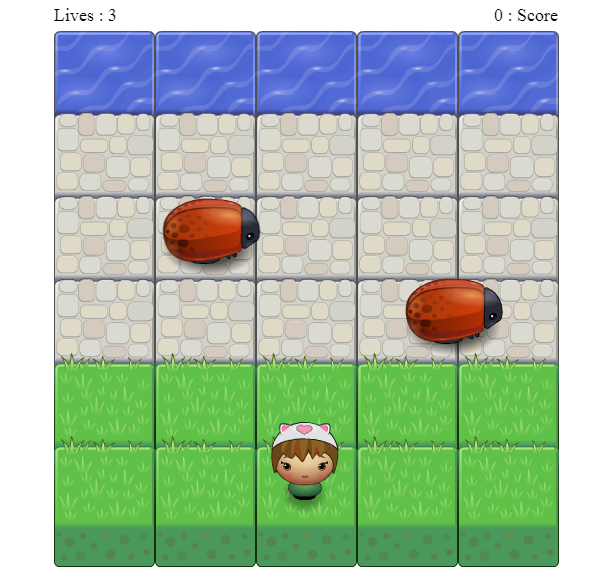

# Classic Arcade Game Clone

## Fend Nanodegree - Exploring JS - Objects, Tools and Testing Module

In this game you have a Player and Enemies (Bugs). The goal of the player is to reach the water, without colliding into any one of the enemies. The player can move left, right, up and down. The enemies move in varying speeds on the paved block portion of the scene. Once a the player collides with an enemy, the game is reset and the player moves back to the start square. Once the player reaches the water the game is won.

## Table of Contents

* [Instructions](#instructions)
* [Live version of the game](#liveversion)

## Instructions

How to play :
- Use arrows on your keyboard to move you character around.
- Your objective is to get 10 points (which are obtainable by reaching water).
- Your character has 3 lives, you lose a life once your character collides with an enemy (bug).

Good luck and have fun!

## LiveVersion

Link : https://basqe.github.io/frontend-nanodegree-arcade-game/  

Screenshot : 
